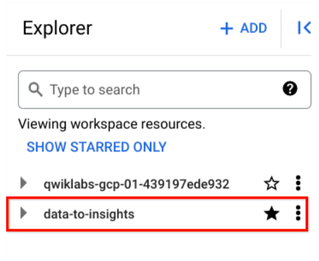
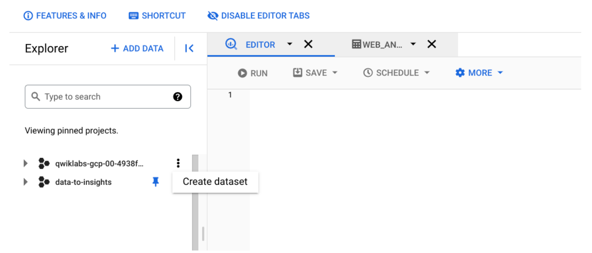
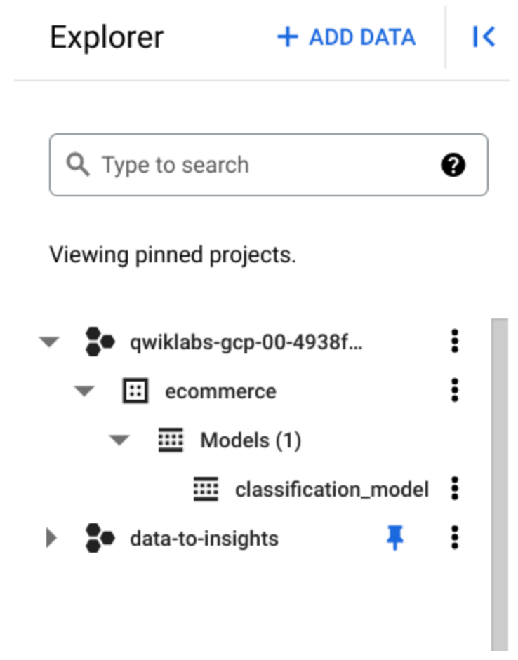
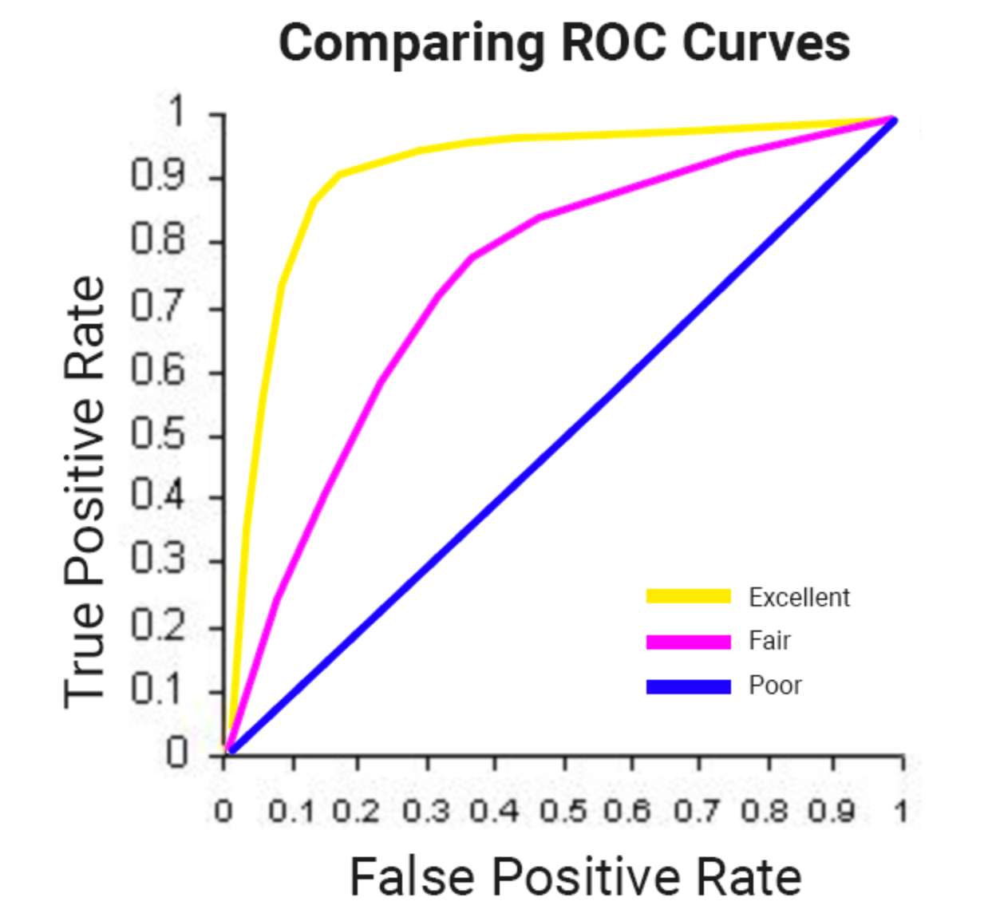

# Predict Visitor Purchases with a Classification Model in BigQuery ML

## Task 0: Access the public dataset in BigQuery
Before we get started, you'll need to get access to the public dataset located in the `cloud-ai-take-off` project. 
- To access it, click [here](https://console.cloud.google.com/bigquery?p=cloud-ai-take-off&d=ecommerce&t=web_analytics&page=table) and open it in a new tab:
- You should see it under **Explorer** - click on the ⭐️ star icon next to it to pin it to your project.



The field definitions for the `cloud-ai-take-off` ecommerce dataset are [here](https://support.google.com/analytics/answer/3437719?hl=en). You can open this in a new tab and keep it open for reference. 

## Task 1: Explore ecommerce data

**Scenario:** Your data analyst team exported the Google Analytics logs for an ecommerce website into BigQuery and created a new table of all the raw ecommerce visitor session data for you to explore. Using this data, you'll try to answer a few questions.

### Question 1a: Out of the total visitors who visited our website, what % made a purchase?

Copy and paste the following query into the BigQuery Editor:
```sql
#standardSQL
WITH visitors AS(
SELECT
COUNT(DISTINCT fullVisitorId) AS total_visitors
FROM `cloud-ai-take-off.ecommerce.web_analytics`
),

purchasers AS(
SELECT
COUNT(DISTINCT fullVisitorId) AS total_purchasers
FROM `cloud-ai-take-off.ecommerce.web_analytics`
WHERE totals.transactions IS NOT NULL
)

SELECT
  total_visitors,
  total_purchasers,
  total_purchasers / total_visitors AS conversion_rate
FROM visitors, purchasers
```
Click **RUN**.

The result --> 2.69%

### Question 1b: What are the top 5 selling products?
Clear the previous query, and then add the following query in the Editor:
```sql
SELECT
  p.v2ProductName,
  p.v2ProductCategory,
  SUM(p.productQuantity) AS units_sold,
  ROUND(SUM(p.localProductRevenue/1000000),2) AS revenue
FROM `cloud-ai-take-off.ecommerce.web_analytics`,
UNNEST(hits) AS h,
UNNEST(h.product) AS p
GROUP BY 1, 2
ORDER BY revenue DESC
LIMIT 5;
```
Click **RUN**.

The results:

| Row | v2ProductName | v2ProductCategory | units_sold |
| -------- | ------- | ------- | ------- |
| 1 | Nest® Learning Thermostat 3rd Gen-USA - Stainless Steel | Nest-USA | 17651 |
| 2 | Nest® Cam Outdoor Security Camera - USA | Nest-USA | 16930 |
| 3 | Nest® Cam Indoor Security Camera - USA | Nest-USA | 14155 |
| 4 | Nest® Protect Smoke + CO White Wired Alarm-USA | Nest-USA | 6394 |
| 5 | Nest® Protect Smoke + CO White Battery Alarm-USA | Nest-USA | 6340 |

### Question 1c: How many visitors bought on subsequent visits to the website?
Clear the previous query, and then add the following query in the Editor:
```sql
# visitors who bought on a return visit (could have bought on first as well
WITH all_visitor_stats AS (
SELECT
  fullvisitorid, # 741,721 unique visitors
  IF(COUNTIF(totals.transactions > 0 AND totals.newVisits IS NULL) > 0, 1, 0) AS will_buy_on_return_visit
  FROM `cloud-ai-take-off.ecommerce.web_analytics`
  GROUP BY fullvisitorid
)

SELECT
  COUNT(DISTINCT fullvisitorid) AS total_visitors,
  will_buy_on_return_visit
FROM all_visitor_stats
GROUP BY will_buy_on_return_visit
```
Click **RUN**.

The results:

| Row | total_visitors | will_buy_on_return_visit |
| -------- | ------- | ------- |
| 1 | 729848 | 0 |
| 2 | 11873 | 1 |

Analyzing the results, you can see that (11873 / 741721) = 1.6% of total visitors will return and purchase from the website. This includes the subset of visitors who bought on their very first session and then came back and bought again.

### Question 1d: What are some of the reasons a typical ecommerce customer will browse but not buy until a later visit?
**Answer:** Although there is no one right answer, one popular reason is comparison shopping between different ecommerce sites before ultimately making a purchase decision. This is very common for luxury goods where significant up-front research and comparison is required by the customer before deciding (think car purchases) but also true to a lesser extent for the merchandise on this site (t-shirts, accessories, etc).

In the world of online marketing, identifying and marketing to these future customers based on the characteristics of their first visit will increase conversion rates and reduce the outflow to competitor sites.

## Task 2: Identify an objective

Now you will create a Machine Learning model in BigQuery to predict whether or not a new user is likely to purchase in the future. Identifying these high-value users can help your marketing team to target them with special promotions and ad campaigns to ensure a conversion while they comparison shop between visits to your ecommerce site.

## Task 3: Select features and create your training dataset

Google Analytics captures a wide variety of dimensions and measures about a user's visit on this ecommerce website. Browse the complete list of fields in the [[UA] BigQuery Export schema documentation](https://support.google.com/analytics/answer/3437719?hl=en) and then [preview the demo dataset](https://console.cloud.google.com/bigquery?project=&p=cloud-ai-take-off&d=ecommerce&t=web_analytics&page=table) to find useful features that will help a machine learning model understand the relationship between data about a visitor's first time on your website and whether they will return and make a purchase.

Your team decides to test whether these two fields are good inputs for your classification model:
- totals.bounces (whether the visitor left the website immediately)
- totals.timeOnSite (how long the visitor was on our website)

### Question 3a: What are the risks of only using the above two fields?
**Answer:** Machine learning is only as good as the training data that is fed into it. If there isn't enough information for the model to determine and learn the relationship between your input features and your label (in this case, whether the visitor bought in the future) then you will not have an accurate model. While training a model on just these two fields is a start, you will see if they're good enough to produce an accurate model.

In the BigQuery Editor, run the following query:
```sql
SELECT
  * EXCEPT(fullVisitorId)
FROM

  # features
  (SELECT
    fullVisitorId,
    IFNULL(totals.bounces, 0) AS bounces,
    IFNULL(totals.timeOnSite, 0) AS time_on_site
  FROM
    `cloud-ai-take-off.ecommerce.web_analytics`
  WHERE
    totals.newVisits = 1)
  JOIN
  (SELECT
    fullvisitorid,
    IF(COUNTIF(totals.transactions > 0 AND totals.newVisits IS NULL) > 0, 1, 0) AS will_buy_on_return_visit
  FROM
      `cloud-ai-take-off.ecommerce.web_analytics`
  GROUP BY fullvisitorid)
  USING (fullVisitorId)
ORDER BY time_on_site DESC
LIMIT 10;
```
Click **RUN**.

The results:

| Row | bounces | time_on_site | will_buy_on_return_visit |
| -------- | ------- | ------- | ------- |
| 1 | 0 | 15047 | 0 |
| 2 | 0 | 12136 | 0 |
| 3 | 0 | 11201 | 0 |
| 4 | 0 | 10046 | 0 |
| 5 | 0 | 9974 | 0 | 
| 6 | 0 | 9564 | 0 |
| 7 | 0 | 9520 | 0 |
| 8 | 0 | 9275 | 1 |
| 9 | 0 | 9138 | 0 |
| 10 | 0 | 8872 | 0 |


### Question 3b: Which fields are the input features and the label?
**Answer:** The inputs are ```bounces``` and ```time_on_site```. The label is ```will_buy_on_return_visit```.

### Question 3c: Which two fields are known after a visitor's first session?
**Answer:**  ```bounces``` and ```time_on_site``` are known after a visitor's first session.

### Question 3d: Which field isn't known until later in the future?
**Answer:**  ```will_buy_on_return_visit``` is not known after the first visit. Again, you're predicting for a subset of users who returned to your website and purchased. Since you don't know the future at prediction time, you cannot say with certainty whether a new visitor will come back and purchase. The value of building an ML model is to get the probability of future purchase based on the data gleaned about their first session.

### Question 3e: Looking at the initial data results, do you think time_on_site and bounces will be a good indicator of whether the user will return and purchase or not?
**Answer:** It's often too early to tell before training and evaluating the model, but at first glance out of the top 10 time_on_site, only 1 customer returned to buy, which isn't very promising. Let's see how well the model does.

## Task 4: Create a BigQuery dataset to store models

Next, create a new BigQuery dataset which will also store your ML models.

In the left pane, under the **Explorer** section, click on the **View actions** icon next to your project name, and then click **Create dataset**.



In the **Create dataset** dialog:
- For Dataset ID, type **"ecommerce"**.
- Leave the other values at their defaults.
- Click **Create dataset.**

## Task 5: Select a BigQuery ML model type and specify options

Now that you have your initial features selected, you are now ready to create your first ML model in BigQuery.

There are the two model types to choose from:
| Model | Model Type | Label Data Type | Example
|  --------  |  -------  | -------  | -------  |
| Forecasting | linear_reg | Numeric value (typically an integer or floating point) | Forecast sales figures for next year given historical sales data. |
| Classification | logistic_reg | 0 or 1 for binary classification | Classify an email as spam or not spam given the context. |

**Which model type should you choose?**

Since you are bucketing visitors into "will buy in future" or "won't buy in future", use logistic_reg in a classification model.

The following query creates a model and specifies model options. Run this query to train your model:
```sql
CREATE OR REPLACE MODEL `ecommerce.classification_model`
OPTIONS
(
model_type='logistic_reg',
input_label_cols = ['will_buy_on_return_visit']
)
AS

#standardSQL
SELECT
  * EXCEPT(fullVisitorId)
FROM

  # features
  (SELECT
    fullVisitorId,
    IFNULL(totals.bounces, 0) AS bounces,
    IFNULL(totals.timeOnSite, 0) AS time_on_site
  FROM
    `cloud-ai-take-off.ecommerce.web_analytics`
  WHERE
    totals.newVisits = 1
    AND date BETWEEN '20160801' AND '20170430') # train on first 9 months
  JOIN
  (SELECT
    fullvisitorid,
    IF(COUNTIF(totals.transactions > 0 AND totals.newVisits IS NULL) > 0, 1, 0) AS will_buy_on_return_visit
  FROM
      `cloud-ai-take-off.ecommerce.web_analytics`
  GROUP BY fullvisitorid)
  USING (fullVisitorId)
;
```
Wait for the model to train - it takes about 5 - 10 minutes.

> [!NOTE]
> You cannot feed all of your available data to the model during training since you need to save some unseen data points for model evaluation and testing. To accomplish this, add a WHERE clause condition is being used to filter and train on only the first 9 months of session data in your 12 month dataset.

After your model is trained, you will see the message:


Click **Go to model.** Look inside the ecommerce dataset and confirm **classification_model** now appears.



Next, you evaluate the performance of the model against new unseen evaluation data.

## Task 6: Evaluate classification model performance

### Select your performance criteria
For classification problems in ML, you want to minimize the False Positive Rate (predict that the user will return and purchase and they don't) and maximize the True Positive Rate (predict that the user will return and purchase and they do).

This relationship is visualized with a ROC (Receiver Operating Characteristic) curve like the one shown here, where you try to maximize the area under the curve or AUC:



In BigQuery ML, **roc_auc** is simply a queryable field when evaluating your trained ML model.
- Now that training is complete, run this query to evaluate how well the model performs using **ML.EVALUATE**:
```sql
SELECT
  roc_auc,
  CASE
    WHEN roc_auc > .9 THEN 'good'
    WHEN roc_auc > .8 THEN 'fair'
    WHEN roc_auc > .7 THEN 'decent'
    WHEN roc_auc > .6 THEN 'not great'
  ELSE 'poor' END AS model_quality
FROM
  ML.EVALUATE(MODEL ecommerce.classification_model,  (

SELECT
  * EXCEPT(fullVisitorId)
FROM
  # features
  (SELECT
    fullVisitorId,
    IFNULL(totals.bounces, 0) AS bounces,
    IFNULL(totals.timeOnSite, 0) AS time_on_site
  FROM
    `cloud-ai-take-off.ecommerce.web_analytics`
  WHERE
    totals.newVisits = 1
    AND date BETWEEN '20170501' AND '20170630') # eval on 2 months
  JOIN
  (SELECT
    fullvisitorid,
    IF(COUNTIF(totals.transactions > 0 AND totals.newVisits IS NULL) > 0, 1, 0) AS will_buy_on_return_visit
  FROM
      `cloud-ai-take-off.ecommerce.web_analytics`
  GROUP BY fullvisitorid)
  USING (fullVisitorId)
));
```
You should see the following result:
| Row | roc_auc | model_quality |
|  --------  |  -------  | -------  |
| 1 | 0.7238561438561438 | decent |

After evaluating your model you get a **roc_auc** of 0.72, which shows the model has decent, but not great, predictive power. Since the goal is to get the area under the curve as close to 1.0 as possible, there is room for improvement


## Task 7: Improve model performance with Feature Engineering

As was hinted at earlier, there are many more features in the dataset that may help the model better understand the relationship between a visitor's first session and the likelihood that they will purchase on a subsequent visit.

Add some new features and create a second machine learning model called **classification_model_2**:
- How far the visitor got in the checkout process on their first visit
- Where the visitor came from (traffic source: organic search, referring site etc..)
- Device category (mobile, tablet, desktop)
- Geographic information (country)

Create this second model by clicking on **"+" (SQL query)** icon:
```sql
CREATE OR REPLACE MODEL `ecommerce.classification_model_2`
OPTIONS
  (model_type='logistic_reg', input_label_cols = ['will_buy_on_return_visit']) AS

WITH all_visitor_stats AS (
SELECT
  fullvisitorid,
  IF(COUNTIF(totals.transactions > 0 AND totals.newVisits IS NULL) > 0, 1, 0) AS will_buy_on_return_visit
  FROM `cloud-ai-take-off.ecommerce.web_analytics`
  GROUP BY fullvisitorid
)

# add in new features
SELECT * EXCEPT(unique_session_id) FROM (

  SELECT
      CONCAT(fullvisitorid, CAST(visitId AS STRING)) AS unique_session_id,

      # input_label_cols
      will_buy_on_return_visit,

      MAX(CAST(h.eCommerceAction.action_type AS INT64)) AS latest_ecommerce_progress,

      # behavior on the site
      IFNULL(totals.bounces, 0) AS bounces,
      IFNULL(totals.timeOnSite, 0) AS time_on_site,
      IFNULL(totals.pageviews, 0) AS pageviews,

      # where the visitor came from
      trafficSource.source,
      trafficSource.medium,
      channelGrouping,

      # mobile or desktop
      device.deviceCategory,

      # geographic
      IFNULL(geoNetwork.country, "") AS country

  FROM `cloud-ai-take-off.ecommerce.web_analytics`,
     UNNEST(hits) AS h

    JOIN all_visitor_stats USING(fullvisitorid)

  WHERE 1=1
    # only predict for new visits
    AND totals.newVisits = 1
    AND date BETWEEN '20160801' AND '20170430' # train 9 months

  GROUP BY
  unique_session_id,
  will_buy_on_return_visit,
  bounces,
  time_on_site,
  totals.pageviews,
  trafficSource.source,
  trafficSource.medium,
  channelGrouping,
  device.deviceCategory,
  country
);
```

> [!NOTE]
> You are still training on the same first 9 months of data, even with this new model. It's important to have the same training dataset so you can be certain a better model output is attributable to better input features and not new or different training data.

A new key feature that was added to the training dataset query is the maximum checkout progress each visitor reached in their session, which is recorded in the field hits.eCommerceAction.action_type. If you search for that field in the [field definitions](https://support.google.com/analytics/answer/3437719?hl=en) you will see the field mapping of 6 = Completed Purchase.

>[!NOTE]
> The web analytics dataset has nested and repeated fields like [ARRAYS](https://cloud.google.com/bigquery/docs/reference/standard-sql/arrays) which need to be broken apart into separate rows in your dataset. This is accomplished by using the UNNEST() function, which you can see in the above query.

Wait for the new model to finish training - it takes about 5-10 minutes.
    
Evaluate this new model to see if there is better predictive power:
```sql
#standardSQL
SELECT
  roc_auc,
  CASE
    WHEN roc_auc > .9 THEN 'good'
    WHEN roc_auc > .8 THEN 'fair'
    WHEN roc_auc > .7 THEN 'decent'
    WHEN roc_auc > .6 THEN 'not great'
  ELSE 'poor' END AS model_quality
FROM
  ML.EVALUATE(MODEL ecommerce.classification_model_2,  (

WITH all_visitor_stats AS (
SELECT
  fullvisitorid,
  IF(COUNTIF(totals.transactions > 0 AND totals.newVisits IS NULL) > 0, 1, 0) AS will_buy_on_return_visit
  FROM `cloud-ai-take-off.ecommerce.web_analytics`
  GROUP BY fullvisitorid
)

# add in new features
SELECT * EXCEPT(unique_session_id) FROM (

  SELECT
      CONCAT(fullvisitorid, CAST(visitId AS STRING)) AS unique_session_id,

      # input_label_cols
      will_buy_on_return_visit,

      MAX(CAST(h.eCommerceAction.action_type AS INT64)) AS latest_ecommerce_progress,

      # behavior on the site
      IFNULL(totals.bounces, 0) AS bounces,
      IFNULL(totals.timeOnSite, 0) AS time_on_site,
      totals.pageviews,

      # where the visitor came from
      trafficSource.source,
      trafficSource.medium,
      channelGrouping,

      # mobile or desktop
      device.deviceCategory,

      # geographic
      IFNULL(geoNetwork.country, "") AS country

  FROM `cloud-ai-take-off.ecommerce.web_analytics`,
     UNNEST(hits) AS h

    JOIN all_visitor_stats USING(fullvisitorid)

  WHERE 1=1
    # only predict for new visits
    AND totals.newVisits = 1
    AND date BETWEEN '20170501' AND '20170630' # eval 2 months

  GROUP BY
  unique_session_id,
  will_buy_on_return_visit,
  bounces,
  time_on_site,
  totals.pageviews,
  trafficSource.source,
  trafficSource.medium,
  channelGrouping,
  device.deviceCategory,
  country
)
));
```
**Output:**
| Row | roc_auc | model_quality |
|  --------  |  -------  | -------  |
| 1 | 0.9094875124875125 | good |

With this new model you now get a **roc_auc** of 0.91 which is significantly better than the first model.

Now that you have a trained model, time to make some predictions.
## Task 8. Predict which new visitors will come back and purchase

Next you will write a query to predict which new visitors will come back and make a purchase.

-   The prediction query below uses the improved classification model to predict the probability that a first-time visitor to the Google Merchandise Store will make a purchase in a later visit:
```sql
SELECT
*
FROM
  ml.PREDICT(MODEL `ecommerce.classification_model_2`,
   (

WITH all_visitor_stats AS (
SELECT
  fullvisitorid,
  IF(COUNTIF(totals.transactions > 0 AND totals.newVisits IS NULL) > 0, 1, 0) AS will_buy_on_return_visit
  FROM `cloud-ai-take-off.ecommerce.web_analytics`
  GROUP BY fullvisitorid
)

  SELECT
      CONCAT(fullvisitorid, '-',CAST(visitId AS STRING)) AS unique_session_id,

      # input_label_cols
      will_buy_on_return_visit,

      MAX(CAST(h.eCommerceAction.action_type AS INT64)) AS latest_ecommerce_progress,

      # behavior on the site
      IFNULL(totals.bounces, 0) AS bounces,
      IFNULL(totals.timeOnSite, 0) AS time_on_site,
      totals.pageviews,

      # where the visitor came from
      trafficSource.source,
      trafficSource.medium,
      channelGrouping,

      # mobile or desktop
      device.deviceCategory,

      # geographic
      IFNULL(geoNetwork.country, "") AS country

  FROM `cloud-ai-take-off.ecommerce.web_analytics`,
     UNNEST(hits) AS h

    JOIN all_visitor_stats USING(fullvisitorid)

  WHERE
    # only predict for new visits
    totals.newVisits = 1
    AND date BETWEEN '20170701' AND '20170801' # test 1 month

  GROUP BY
  unique_session_id,
  will_buy_on_return_visit,
  bounces,
  time_on_site,
  totals.pageviews,
  trafficSource.source,
  trafficSource.medium,
  channelGrouping,
  device.deviceCategory,
  country
)

)

ORDER BY
  predicted_will_buy_on_return_visit DESC;
```

The predictions are made in the last 1 month (out of 12 months) of the dataset. Your model now outputs its predictions for those July 2017 ecommerce sessions. You can see three newly added fields:
-   predicted_will_buy_on_return_visit: whether the model thinks the visitor will buy later (1 = yes)
-   predicted_will_buy_on_return_visit_probs.label: the binary classifier for yes / no
-   predicted_will_buy_on_return_visit.probs.prob: the confidence the model has in it's prediction (1 = 100%)


## Task 9. Analyze results and additional information
### Results
-   Of the top 6% of first-time visitors (sorted in decreasing order of predicted probability), more than 6% make a purchase in a later visit.  
-   These users represent nearly 50% of all first-time visitors who make a purchase in a later visit.
-   Overall, only 0.7% of first-time visitors make a purchase in a later visit. 
-   Targeting the top 6% of first-time increases marketing ROI by 9x vs targeting them all!

### Additional information
**Tip:** add warm_start = true to your model options if you are retraining new data on an existing model for faster training times. Note that you cannot change the feature columns (this would necessitate a new model).

**roc_auc** is just one of the performance metrics available during model evaluation. Also available are [accuracy, precision, and recall](https://en.wikipedia.org/wiki/Precision_and_recall). Knowing which performance metric to rely on is highly dependent on what your overall objective or goal is.

### Other datasets to explore
You can use the bigquery-public-data project if you want to explore modeling on other datasets like forecasting fares for taxi trips.
1.  To open the **bigquery-public-data** dataset, click **+Add**. 
2. Click **Star a project by name** under Additional sources.
3.  Then write the bigquery-public-data name.
4.  Click **Star**.

The bigquery-public-data project is listed in the **Explorer** section.
